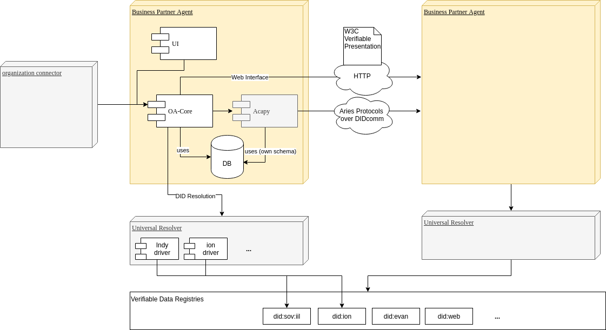

# Business Partner Agent [![join the chat][rocketchat-image]][rocketchat-url]

[rocketchat-url]: https://chat.hyperledger.org/channel/business-partner-agent
[rocketchat-image]: https://open.rocket.chat/images/join-chat.svg

[](LICENSE)
[](https://dev.azure.com/economy-of-things/Business-Partner-Agent/_build/latest?definitionId=79&branchName=master)

# Short Description

The Business Partner Agent allows to manage and exchange master data between organizations.

# Scope of Lab

The Business Partner Agent is a domain-specific controller and extension for Aries Cloud Agent Python. It allows to manage and to publish public organizational master data tied to a decentralized identifier (DID) as well as to share and to request business partner specific master data and certifications.

The project consists of a backend written in Java that provides domain-specific APIs for integration in enterprise systems, as well as a simple reference user interface.



## Project Status

A first version of Business Partner Agent is available in branch
[master](https://github.com/hyperledger-labs/organizational-agent/tree/master).
It is not ready for production use. But with the API available it is at a stage
where you could try it out. The frontend is under construction.

# Getting Started

The Business Partner Agent supports two modes

1. Web mode: Serves a did:web identity and allows to publish a public organizational profile.
2. Aries mode: Utilizes an identity on an Hyperledger Indy ledger (default: https://indy-test.bosch-digital.de/) and enables Aries interaction protocols.

Following this turorial, the agent will be started in Aries mode.

## Prerequistes

The following tools should be installed on your developer machine:

- docker
- docker-compose
- (optional) [ngrok](https://ngrok.com/) or [diode](https://support.diode.io/) to have a public endpoint to communicate with other Business Partner Agents

As well, make sure you are not sitting behind a restrictive company firewall.
If so, at least the setup has to be adopted (e.g. configure proxy configuration in the maven settings in the [Dockerfile](./Dockerfile)).
Furthermore the firewall might block traffic to other agents depending on its endpoint configuration (if e.g. in the firewall other ports than 443 are blocked).

## Quickstart

```s
git clone https://github.com/hyperledger-labs/business-partner-agent
cd ./business-partner-agent
./scripts/register-did.sh
./start-with-tunnels.sh
```

The frontend will be served at `http://localhost:8080`.

## Register a new DID before starting an Business Partner Agent

You can use the `./scripts/register-did.sh` script to register a new DID on our test network.
Just run:

```s
./scripts/register-did.sh
```

You should see the following outpout:

```s
{
  "did": "W3KMxGKUmajhiJzGmqVcAM",
  "seed": "rxg9SAfvJsdQZjcsguSQCJofuPMmK4Ke",
  "verkey": "Gq1ZuUcU4mwkdinNjwovDMgYhNq2Z6gVdbf9WgFFbQEb"
}
Registration on https://indy-test.bosch-digital.de successful
Setting AGENT_SEED in .env file
```

Alternatively, you can register a DID manually:

1. Go to https://indy-test.bosch-digital.de/
2. Provide a 32 characterer wallet seed on the right side under "Authenticate a new DID" and click on "Register DID"
3. Make a copy of the provided [.env-example file](.env-example) with the name `.env`. Set the `AGENT_SEED` to the wallet seed.

## Start a Business Partner Agent instance

You can start an instance of the Business Partner Agent with docker compose. It will start the following

- Frontend (Vue.js)
- Controller Backend (Java Micronaut)
- Aries Cloud Agent Python
- Postgres

with a default configuration.

### Build and run

```s
docker-compose up
```

### Rebuild

```s
docker-compose build
```

Access the frontend:

http://localhost:8080

Access the swagger-ui:

http://localhost:8080/swagger-ui

### Stopping the instance

```s
docker-compose down
```

If you want to wipe the database as well you can use

```s
docker-compose down -v
```

## Getting a public IP

If you did not deploy your agent on a server with a public ip it won't have public endpoints to communicate with other agents.
A simple way to get public endpoints for your agent is to setup [ngrok](https://ngrok.com/).

If you have setup ngrok you can use the `start-with-tunnels.sh` script to start your agent with public endpoints.

```s
./start-with-tunnels.sh
```

To terminate all ngrok tunnels you can use

```s
./kill-tunnels.sh
```

**_BE AWARE:_** If you don't have any security enabled the Business Partner API and and the frontend will be publicly available. This is in particular important when running in Aries mode where the public IP is written to the ledger.

### Setup Security

In your `.env` under `Security config` file set

```s
BPA_SECURITY_ENABLED=true
```

and a user name and password.

## Play a demo scenario

See [demo](./demo.md)

# Initial Committers

- https://github.com/etschelp
- https://github.com/frank-bee
- https://github.com/domwoe

# Sponsor

- https://github.com/swcurran Co-Chair of the Aries Working Group

# License

Project source code files are made available under the Apache License, Version 2.0 (Apache-2.0), located in the [LICENSE](LICENSE) file. Project documentation files are made available under the Creative Commons Attribution 4.0 International License (CC-BY-4.0), available at http://creativecommons.org/licenses/by/4.0/.
